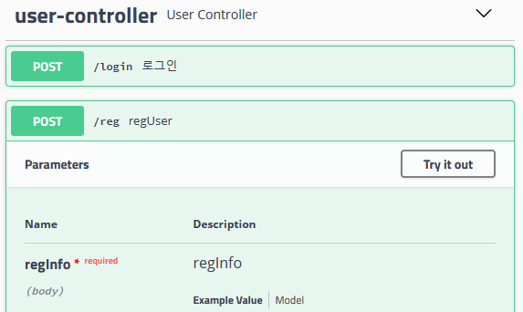

# Spring boot library API
도서관 관련 api를 spring boot로 구현한 프로젝트입니다.

### Feature
+ JWT token 기반 login 기능 제공
+ 관리자로 로그인 하였을 때 도서 삽입, 삭제 기능 제공

### TODO
- [x] postgresql 연동
- [x] swagger 연동 및 authorization 관련 처리
- [x] 도서 생성, 삭제, 조회 API
- [x] 회원 가입, 로그인 API
- [ ] 빌린 책 목록 보는 API에서 user 인가 처리
- [ ] 회원 가입 후 메일 인증 시스템
- [ ] packaging 해서 해당 프로젝트를 서버에 구축하기 편하게끔 배포

## Setup
- git cmd로 아래 명령들을 순서대로 수행합니다.
- _mvn -DskipTests package_ 명령을 수행합니다.
- _target_ 폴더 밑에 jar 파일이 생성되었습니다.
- postgresql에서 database mylib를 생성한 후에, DDL 폴더에 있는 DDL 문을 이용해서 table을 생성합니다.
- 데이터 베이스에 접속하는 계정은 테이블, 시퀀스에 대해서는 아래 권한을 가져야 합니다.

## Usage
* /swagger-ui.html에 접속합니다. https가 활성화 되어 있다면 https로 접속합니다.

</img>

* 회원 가입을 하기 위해서, user-controller를 클릭하시고 reg를 클릭합니다.
* 그러면, Example value 란이 있을 겁니다. Try it out 버튼을 클릭하시고, 가입할 유저의 정보를 입력합니다.
* 가입이 완료되었다면 login을 할 수 있을 겁니다. /login을 클릭하시고, 가입한 유저의 정보를 입력한 다음에 Execute를 누릅니다.
* access_token을 얻어오면, 페이지 맨 위에 있는 authorize를 누릅니다.
* access_token 값을 입력하고 인증을 눌러주시면 됩니다.
